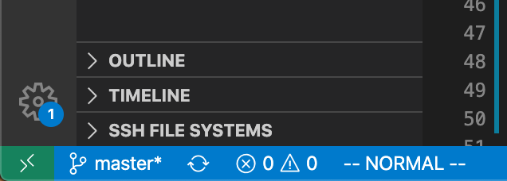
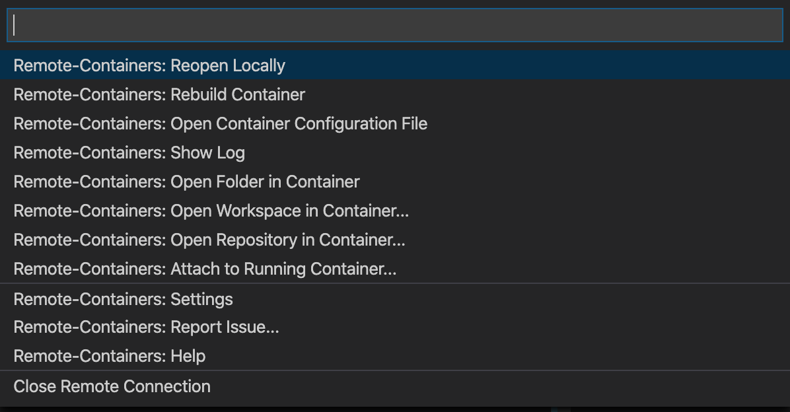

# Devlopment Python
## Require
- Docker
- VSCode 
- VSCode Plugins
    - Remote Containers

## Create Container
1. Select GreenIcon

2. Select `Remote-Containers:Open Folder in Container`

3. Selcet this project directory
4. Select `Remote-Containers: Attach to Running Container`

## Enable vscode intellisense in Container
1. Print python package install path
```
$ docker exec dev-python3 /bin/bash -c "pip list -v" | awk '{print $3}' | uniq | grep "^/" | awk '{printf"\"%s\",\n", $1}'

=========== print example
"/usr/local/lib/python3.8/site-packages",
"/root/.local/lib/python3.8/site-packages",
"/usr/local/lib/python3.8/site-packages",
"/root/.local/lib/python3.8/site-packages",
"/usr/local/lib/python3.8/site-packages",
"/root/.local/lib/python3.8/site-packages",
"/usr/local/lib/python3.8/site-packages",
"/root/.local/lib/python3.8/site-packages",
"/usr/local/lib/python3.8/site-packages",
===========
```

2. Setting `config.json`
```
# create config.json
$ touch .vscode/config.json
```
```
# Save python package install path in config.json
# Example
{
    "python.autoComplete.extraPaths": [
        "/usr/local/lib/python3.8/site-packages",
        "/root/.local/lib/python3.8/site-packages",
        "/usr/local/lib/python3.8/site-packages",
        "/root/.local/lib/python3.8/site-packages",
        "/usr/local/lib/python3.8/site-packages",
        "/root/.local/lib/python3.8/site-packages",
        "/usr/local/lib/python3.8/site-packages",
        "/root/.local/lib/python3.8/site-packages",
        "/usr/local/lib/python3.8/site-packages",
        "/root/.local/lib/python3.8/site-packages",
    ],
}
```

